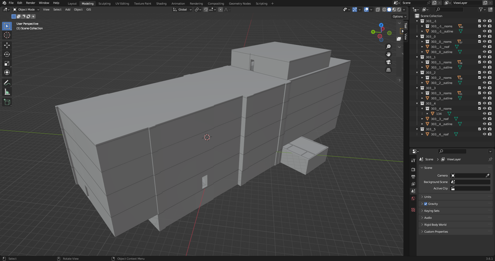

# Blender project
For the Bachelor thesis the building 303 was modelled. In this branch you find the complete [Blender project](303__complete.blend) as well as the glTF models of each level of the building as [.glTF](.glTF) and [.glb](.glb) file.

## Complete appendix of the thesis:
- [Blender Project](https://github.com/ChrisClsg/tilesetGenerator/tree/3D-building)
- [Code tilesetGenerator v1.0.0](https://github.com/ChrisClsg/tilesetGenerator/tree/v1.0.0)
- [Running tilesetGenerator app](https://campusgis2.uni-koeln.de/tilesetgenerator/)
- [Generated 3D Tiles tilesets](https://github.com/ChrisClsg/tilesetGenerator/tree/tilesets)
